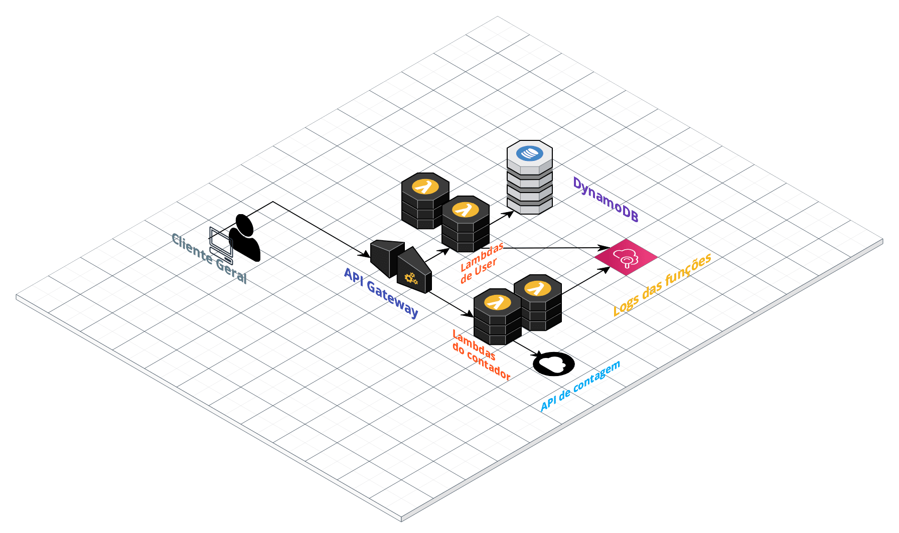
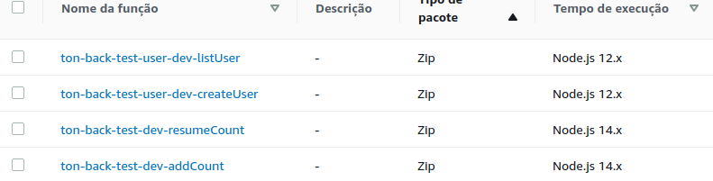

# Ton Backend Test

Esse repositório guardo o código fonte do teste de backend da Ton.

## Do Problema

O problema consite em criar uma API (Application Program Interface) que tenha a função de realizar:
- Contagem de cliques no site do Ton;
- Exibir a quantidade de cliques;
- Cadastrar um usuário;
- Listar um usuário.

## Das ferramentas

Tendo em vista o forte uso da arquitetura serverless dentro da Ton, e como indicado pelo texto do desafio, forma utilizados as seguintes ferramentas e tecnologias:

- Node.js como ambiente de execução e principal ferramenta;
- Serverless framework ⚡
- AWS Lambdas ☁️
- DynamoDB
- Api Gateway 🔛

## Arquitetura da solução

A Api foi dividida em dois diretórios, de acordo com a responsabilidade. O primeiro diretório é o `ton-back-test`, que guarda as functions responsáveis pelo a funcionalidade de incrementar um contador de cliques e de retornar um resumo de quantidade de cliques.

O diretório responsável pelo usuário é o `ton-back-test-use`. Nele estão as funções que criam um usuário e que listam os dados de um usuário.

O diagrama a seguir mostra de forma resumida a arquitetura em nuvem.



O cliente terá acesso às funcionalidades através de um API Gateway, que por sua vez está ligado às lambdas de contador e de usuário.

As lambdas de contador de cliques farão requisições para a API https://countapi.xyz/. Por sua vez, as lambdas de usuário realização escrita e leitura no banco DynamoDB, na tabela `UserTable`.

Todas as lambdas terão os logs de execução gravadas em um CloudWatch 🔎.

## Execução

É preciso primeiro que haja uma instalação do framework `serverless` na máquina. Para isso é possível instalá-lo através do npm com o seguinte comando:

```bash
npm install -g serverless
```
Mais informações estão na documentação oficial https://www.serverless.com/framework/docs/getting-started.

Após a instalação, realizar a clonagem do repositório através do comando a seguir ou por meio do botão de clone no topo da página do repositório.

```bash
git clone git@github.com:MatheusPSantos/node-teste-back.git
```

Após clonar o repositório, navegue até o diretório de um dos projetos. Aqui vamos usar o diretório `ton-back-test-user`. Dentro do diretório precisamos executar o comando:

```bash
sls deploy --verbose
```

A flag `--verbose` é opcional e serve para que a execução mostre mais informações.
Após isso será possível ver a seguinte saída:

```bash
[...]
Service Information
service: ton-back-test-user
stage: dev
region: us-east-1
stack: ton-back-test-user-dev
resources: 18
api keys:
  None
endpoints:
  POST - https://l5nkld8u69.execute-api.us-east-1.amazonaws.com/user
  GET - https://l5nkld8u69.execute-api.us-east-1.amazonaws.com/user/{id}
functions:
  createUser: ton-back-test-user-dev-createUser
  listUser: ton-back-test-user-dev-listUser
layers:
  None
[...]
```

Na aws será possível ver que as lamndas já estão em nuvem:



O log da execução nos mostra os endpoints onde podemos realizar as requisições http.

## Rotas

A seguir estão detalhadas as rotas e requisição para as mesmas na aplicação em nuvem.

### Incrementar contador
| | |
|--|--|
|Função:| `addCount()`|
|Descrição:| Realiza o incremento de um valor a cada requisição bem sucedida.|
|Método:| `GET`|
|Endpoint:| `https://5rz0w7povb.execute-api.us-east-1.amazonaws.com/count`|
|Retorno:|Json|

Exemplo:
```curl
curl --request GET \
  --url https://5rz0w7povb.execute-api.us-east-1.amazonaws.com/count
```
> retorno:
```json
{
	"value": 5
}    
```

### Obter quantidade da contagem
| | |
|--|--|
|Função:| `resumeCount()`|
|Descrição:| Retorna o número de cliques, ou contagem.|
|Método:| `GET`|
|Endpoint:| `https://5rz0w7povb.execute-api.us-east-1.amazonaws.com/resume`|
|Retorno:| Json|

Exemplo:
```curl
curl --request GET \
  --url https://5rz0w7povb.execute-api.us-east-1.amazonaws.com/resume
```
> retorno:
```json
{
	"value": 5
}
```

### Criar usuário

| | |
|--|--|
|Função:| `createUser()`|
|Descrição:| Cria um usuário e retorna o valor criado.|
|Método:| `POST`|
|Endpoint:| `https://l5nkld8u69.execute-api.us-east-1.amazonaws.com/user`|
|Atributos:|username, email, password|
|Corpo da request:| Json|
|Retorno:| Json|

Exemplo:
```curl

curl --request POST \
  --url https://l5nkld8u69.execute-api.us-east-1.amazonaws.com/user \
  --header 'Content-Type: application/json' \
  --data '{
	"username": "usuarioteste-1",
	"email": "emailteste@gmail.com",
	"password": "qwerty"
}'

```
> retorno:
```json
{
	"id": "0382d454-b6ee-4070-930d-6c7c2815c05c",
	"username": "usuarioteste-1",
	"email": "emailteste@gmail.com",
	"hashed_password": "0dd3e512642c97ca3f747f9a76e374fbda73f9292823c0313be9d78add7cdd8f72235af0c553dd26797e78e1854edee0ae002f8aba074b066dfce1af114e32f8",
	"createdAt": "2021-12-25T21:18:21.177Z"
}
```

### Listar um usuário

| | |
|--|--|
|Função:| `listUser()`|
|Descrição:| Lista um usuário a partir do seu ID.|
|Método:| `GET`|
|Endpoint:| `https://l5nkld8u69.execute-api.us-east-1.amazonaws.com/user/{id}`|
|Parâmetros:|:id - ID do usuário a ser listado|
|Retorno:| Json|

Exemplo:
```curl
curl --request GET \
  --url https://l5nkld8u69.execute-api.us-east-1.amazonaws.com/user/18a780fd-4175-4cb1-9843-91b6d773bfb3

```
> retorno:
```json
{
	"Items": [
		{
			"createdAt": {},
			"username": "usuarioteste",
			"hashed_password": "...",
			"id": "18a780fd-4175-4cb1-9843-91b6d773bfb3",
			"email": "emailteste@gmail.com"
		}
	],
	"Count": 1,
	"ScannedCount": 1
}
```

Caso não seja encontrado um usuário por conta de um ID não existente ou inválido, o retorno será:

```json
{
	"Items": [],
	"Count": 0,
	"ScannedCount": 0
}
```

## Observações Finais

- O projeto não possui testes.
- Para executar na próṕria nuvem será preciso alterar o `iam` de acesso do dynamodb dentro do `serverless.yml` para um que você tenha acesso.
